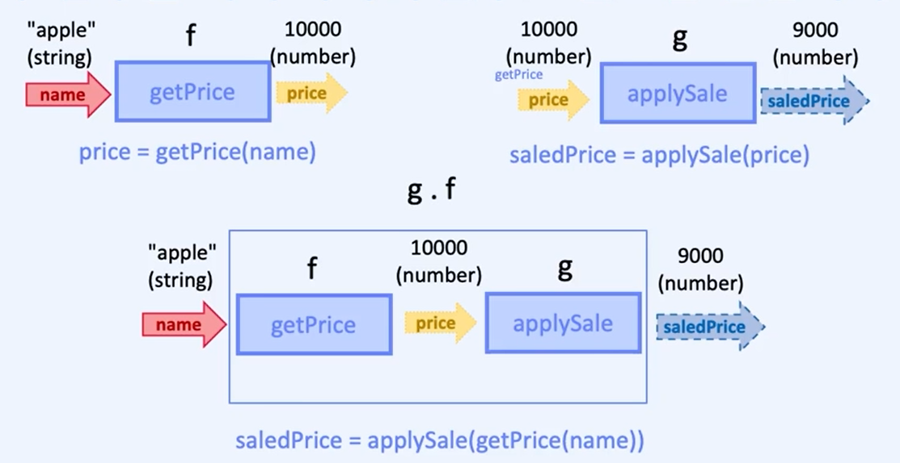
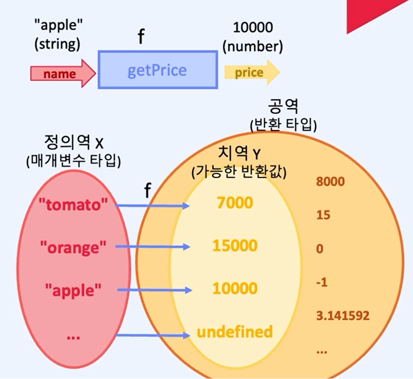

# 함수와 타입

## 1. 부수효과의 어려움

아래와 같은 상황에서는 의미가 불분명한 값이 더해질 수도 있고, 휴먼 이슈도 발생할 수 있다.

```ts
/*
토마토 : 7000원
오렌지: 15000원
사과: 10000원
*/
export let totalPrice = 0;

totalPrice += 7000;
totalPrice += 15000;
totalPrice += 10000;

// 의미가 불분명한 값이 더해짐
totalPrice += 30000;

// 휴먼 이슈일 수도?
totalPrice += 8000;
```

**부수효과가 있는 함수로 분리(명령형)** : 위 보단 낫지만 역시 부수효과를 예측하고 이해하기 어려울 수 있음

```ts
export function addTomato() {
  totalPrice += 7000;
}

export function addOrange() {
  totalPrice += 15000;
}

export function addApple() {
  totalPrice += 10000;
}

export function list1() {
  addTomato();
  addOrange();
  addApple();
}

export function list2() {
  addTomato();
  addTomato();
}

export function list3() {
  //오렌지 100상자
  for (let i = 0; i < 100; i++) {
    addOrange();
  }
}

export function main() {
  list3();
}
```

**순수함수로 변경**

```ts
export function priceOfTomato() {
  return 7000;
}
export function priceOfOrange() {
  return 15000;
}
export function priceOfApple() {
  return 10000;
}

export function list1() {
  return priceOfTomato() + priceOfOrange() + priceOfApple();
}

export function list2() {
  return priceOfTomato() + priceOfTomato();
}

export function list3() {
  return priceOfOrange() * 100;
}

export function getTotalPrice() {
  return list3();
}

// 순수함수는 출력을 주고 추가적인 일은 하지않는다.
// 출력값이 입력값에 대응된다. (사상, 대응)
function getPrice(name: string) {
  if (name === "tomato") return 7000;
  else if (name === "orange") return 15000;
  else if (name === "apple") return 10000;
}

//데이터 수가 많이 없으면 테이블로 만들어서 사용 가능
const priceOfFruit = {
  tomato: 7000,
  orange: 15000,
  apple: 10000,
};

// 모든 대응을 개발자가 직접 작성하는 것은 비효율적이고 실수 할 수 있음
const isEven = {
  tomato: true,
  orange: true,
  apple: false,
};

// 따라서 위 테이블이나 레코드를 직접 작성하는 것이 아닌 함수를 만든다.

const isEvenFv = (str: string) => str.length % 2 === 0;
```

## 2. 함수 합성

함수의 합성이란 한 함수의 공역이 다른 함수의 정의역과 일치하는 경우 두 함수를 이어 하나의 함수로 만드는 연산이다. 함수형 프로그래밍에서 함수는 순수 함수이자 수학적 함수이며 수학적으로 증명된 방식을 그대로 다룰 수 있다.

<p align="center">
  
</p>

**수학에서 함수란?** : 수학에서 함수는 어떤 집합의 각 원소를 다른 집합의 유일한 원소에 대응시키는 이항 관계이다.

- 입력 값들의 집합을 정의역(Domain)이라 한다.
- 이 함숫값들이 속하는 더 큰 집합을 공역(Codomain)이라 한다.
- 치역은 공역의 원소 중 실제로 반환값으로 사용되는 값들의 집합
- 정의역과 공역은 프로그래밍 언어에서 타입에 해당된다.
<p align="center">
  
</p>

**타입이란?** : 할당할 수 있는 값들의 집합

- 수학에서 집합은 특정한 조건에 맞는 별개의 원소들의 모임

**전 함수와 부분 함수** :

- 정의역의 모든 원소에 대해 함수가 정의되어야 한다. (전 함수)
- 가능한 입력 중에 일부에만 반환값이 정의되어 있다. 순수함수가 아니다.(부분함수)

**함수합성, 정의역과 공역이 일치하는 경우** : 정의역과 공역이 일치하는 경우 계속해서 함수를 합성할 수 있다.

```ts
// 타입스크립트에서는 부분함수를 전함수로 바꿈
export function getPrice(name: string): number | undefiend {
  if (name === "tomato") return 7000;
  else if (name === "orange") return 15000;
  else if (name === "apple") return 10000;
}

//getPrice의 공역과 아래 함수의 정의역을 일치 시키기
export const isExpensive = (price: number | undefiend) => {
  if (price === undefiend) return false;
  return price > 10000;
};


//함수를 합성해서 새로운 함수를 만듬
export function isExpensivePrice(name: string) : boolean{
  return isExpensive(getPrice(name));
}


export const main = () => {
  return isExpensive(getPrice("tomato"););
};
```

## 3. 제네릭

함수에 타입을 달아주다보면 비슷하게 생긴 타입이 중복될 때가 있다. 이러한 중복을 제거하기 위해 제네릭을 사용한다.

**아이덴티티** : 입력된 값을 그대로 돌려주는 함수를 뜻함

```ts
const idNumber = (n: number) => {
  return n;
};

const idString = (str: string) => {
  return str;
};

const idBoolean = (bool: boolean) => {
  return bool;
};

//어떤 타입의 값이라도 그대로 돌려주는 함수(제네릭 사용)
const id = <T>(x: T) => {
  return x;
};
```

**제네릭을 이용한 compose 함수**

```ts
//공역과 정의역이 일치한다면 어떠한 함수라도 합성 가능하다.
export const compose =
  <A, B, C>(g: (y: B) => C, f: (s: A) => B) =>
  (x: A) => {
    return g(f(x));
  };

// <A, B, C>(g: (y: B) => C, f: (s: A) => B) => (x: A) => C
//  <A, B, C>((B) => C, f: (A) => B) => (A) => C
```
