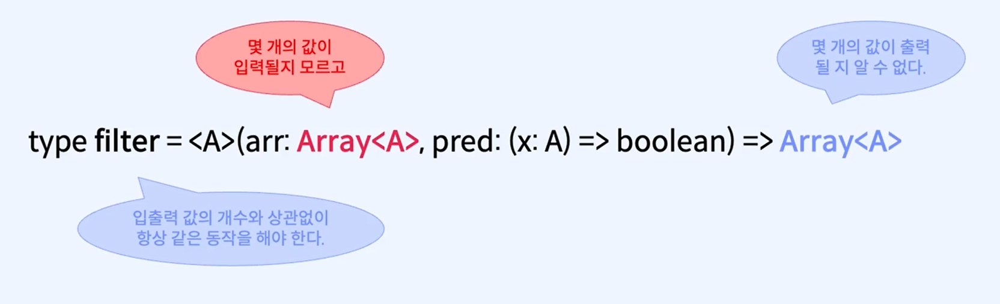

# Array : 여러 개 일 수 있는 값

## 1. 비결정성 :

값이 하나로 결정되지 않는 것을 비결정성이라 한다.

**1개로 결정되는 값** :

```ts
const one: number = 1;
const str: string = "hello, world!";
```

**개수를 결정할 수 없는 값들** :

```ts
const numbers: Array<number> = [1, 2, 3];
const strings: Array<string> = ["hello", "world"];
```

**Array와 List 비교** :
기본적으로 이 둘은 여러가지 값을 가질 수 있다.

Array(배열)은 인덱스로 임의 접근에 최적화, list는 순차적이고 재귀적 구조이며 순차처리에 최적화 되어있다. JS에서는 기본 내장으로 Array를 사용한다. 또한 함수형 프로그래밍에서는 원소에 대한 임의 접근이 꼭 필요한 것이 아니라면, 리스트를 선호하기도 한다.

**비결정적인 함수** :

<p align="center">
  
</p>

## 2. 고차함수(higher-order function)

하나 이상의 함수를 인자로 받거나 함수를 반환하는 함수를 고차함수라고 한다.

**다른 함수를 매개변수로 입력 받는 함수** :

```ts
type hof1 = (func: 함수, x: 인자) => B

function(func: 함수, x: 인자): B {
  const y = func(x);
  return y;
}
```

**새로운 함수를 반환하는 함수** :

```ts
type hof2 = (a:A) => 함수

function(a: A): 함수 {
  return (b:B) => a + b
}
```

**Array.map 만들어보기**:

```ts
//기존에 직접 다루던 부수효과를 분리해서 격리한 후에 별도의 효과로 취급할 수 있도록 추상화한다.
export const map = <A, B>(array: Array<A>, f: (a: A) => B): Array<B> => {
  const result: Array<B> = [];
  for (const value of array) {
    result.push(f(value));
  }
  return result;
};
```

## 3. 타입 다시보기

**타입이란?** : 할당할 수 있는 값들의 집합

```ts
//값이 반환되지 않는 예외 던지기
function stringToNumber(s) {
  const result = Number(s);
  if (isNaN(result)) {
    //부수효과!
    throw Error(s + ": 숫자가 아닙니다.");
  }
  return result;
}
```

이러한 예외 처리도 데이터로 인코딩해서 명시적인 타입을 부여해서 다루어야 한다. 함수형 프로그래밍에서는 예외를 표현하는 데이터 타입으로
Try, Result, Either로 구현한다.

위에 코드를 명시적인 타입으로 나타내려면 다음과 같이 나타내면 된다.

```ts
type Try<T> = Error | T
(s: string) => Try<number>
```

함수의 타입 내에서 타입 파라미터가 같은 매개변수와 리턴타입은 반드시 같은 타입이여야 한다. 그러나 타입 파라미터가 서로 다를 때는 다른 타입을 사용해도 되지만 꼭 같은 타입일 필요는 없다.

```ts
type map<A,B> = (Array<A>, A => B) => Array<B>

//예시
(Array<number>, number => B) => Array<B>
```

위에 예시를 보면 Array의 인자 타입이 number라면
두번째 인자인 함수의 인자 타입도 number여야 한다.
하지만 두번째 인자인 함수의 리턴 타입은 A(number)와 독립적이기 때문에 같아도 되고, 달라도 된다.

```ts
//연습해보기

export type MapType<A, B> = (xs: Array<A>, f: (x: A) => B) => Array<B>;
// (Array<A>, A => B) => Array<B>

export type MapType1 = MapType<number, number>;
// (Array<number>, number => string) => Array<string>

export type Compose<A, B, C> = (g: (y: B) => C, f: (x: A) => B) => (a: A) => C;
// (B => C, A => B) => A => C

export type Compose1 = Compose<string, number, boolean>;
// (number => boolean, string => number) => string => boolean
```

## 4. map을 쓸 때 주의해야 하는 점은 리턴타입이 void인지 확인하는 것

함수형 프로그래밍에서 순수함수와 고차함수를 사용해서 효과를 분리하고 함수들을 서로 합성하고 조합해서 사용하는 것은 사람의 생각과 최대한 가깝게 작성하기 위함이다.

```
부수효과를 일으키는 함수는 void나 유닛과 같은 값을 리턴한다. 주의할 점은 void를 리턴하는 함수는 그곳에서 종료되는 것이기 때문에 더이상 함수 합성이 불가능하다. 부수효과 격리의 최상 지점이라 생각하면 된다. 마찬가지로 map에 들어가는 함수가 void를 리턴한다면 map보단 forEach를 써야한다. 하지만, 이러한 경우 더이상 함수 합성이 불가능하기 때문에 주의해야 한다.
```

## 5. 다중 for문을 다루는 법

```ts
const suits = ["♠", "♥", "♣", "♦"];
const numbers = [
  "2",
  "3",
  "4",
  "5",
  "6",
  "7",
  "8",
  "9",
  "10",
  "J",
  "Q",
  "K",
  "A",
];

export const main = () => {
  const app = document.getElementById("app");
  if (app === null) {
    return;
  }

  app.innerHTML = `
  <h1>cards</h1>
  <pre>${JSON.stringify(cards2, null, 2)}
  </pre>
  `;
};
```

**중첩 for문**

```ts
const cards: Array<string> = [];
for (const suit of suits) {
  for (const number of numbers) {
    cards.push(suit + number);
  }
}
```

**함수로 분리**

```ts
// 모든 카드목록은 아래의 작업이 완료된 것이다.
const cards2 =
  // 아래의 작업을 모든 무늬에 적용한다.
  suits
    .map((suit) =>
      //    아래의 작업을 모든 숫자에 적용한다.
      numbers.map(
        (number) =>
          //      카드는 무늬와 숫자를 연결 한 문자열이다.
          suit + number
      )
    )
    // 무늬별로 나누어진 카드를 하나로 합친다.
    // Array<Array<T>> => Array<T>
    .flat();
```

**flatmap 사용**

```ts
// 모든 카드목록은 아래의 작업이 완료된 것이다.
const cards2 =
  // 아래의 작업을 모든 무늬에 적용한다.
  suits.flatMap((suit) =>
    //    아래의 작업을 모든 숫자에 적용한다.
    numbers.map(
      (number) =>
        //      카드는 무늬와 숫자를 연결 한 문자열이다.
        suit + number
    )
  );
```
